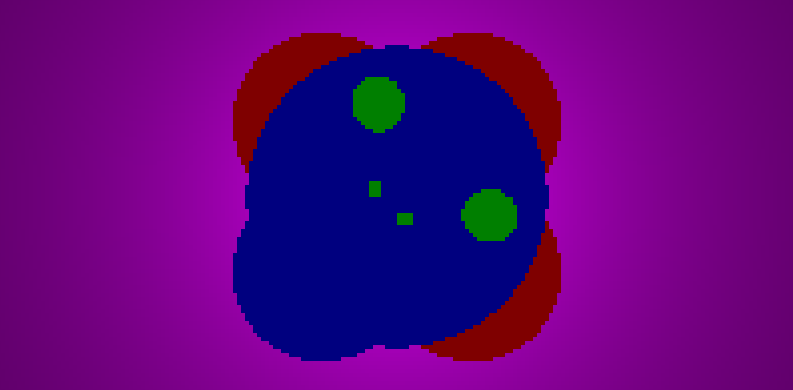
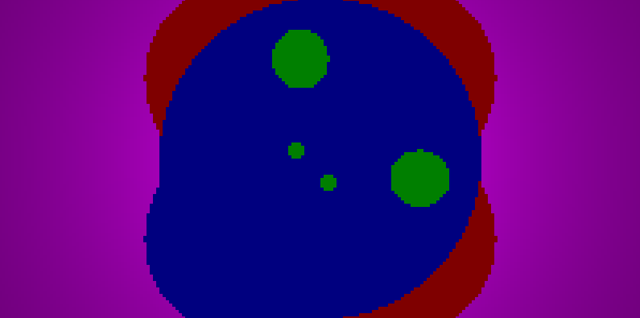
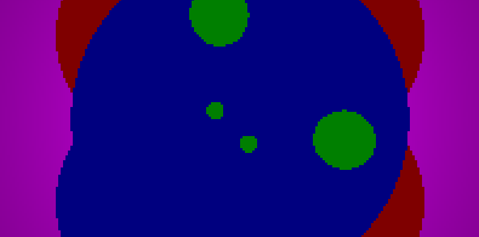
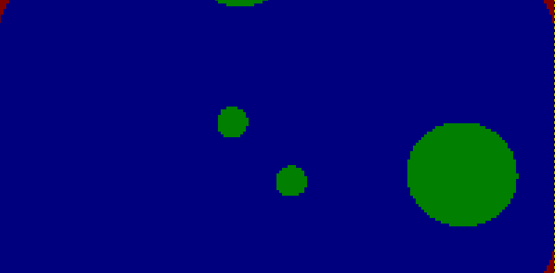
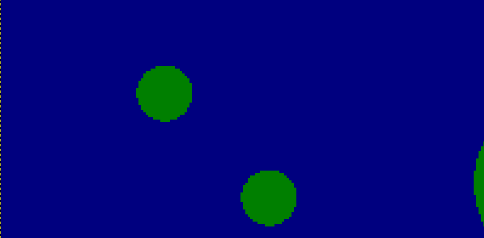

# Extra Questions

1. Changing the Vector corresponding to the eye is functionally equivalent (or seems to be functionally equivalent) to rotating the entire scene. Visualising this is easy as one can take our own eyes as a functional replacement. Moving the eyes rotates the screen along the corresponding axis. Basic Tests were conducted to show this :

The above shows the basic image with eye at (0,1,0)

The above shows the basic image with eye flipped at (0,-1,0)

Same was seen when the eye was moved to the X-axis. That corresponds to a 90 degree rotation. The image seems to mirror that change.

Eye at (1,0,0)

Eye flipped;At (-1,0,0)

As expected though, since my view was set to (0,0,-1), when the eye was set to the z-axis, the image was rather flat and changes to the sign of the vector which seemed to invert the rotation of the image didn't happen. This should be the effect of the cross product between view and up (both would evaluate to a zero-vector)

Eye at (0,0,1)

Eye flipped;At (0,0,-1)

Tests with eye along 2 axes (x,y) :

Image comes at an angle.

Tests with eye along 3 axes (x,y,z) :

Image comes at an angle same as previous one, once again showing effects of the cross product.

2. Changing the FOV seems to have an impact mainly on the location of the virtual viewing window and the location of the corresponding rays casted, and correspondingly seems to sort of zoom-in or zoom-out on the object(s). This is as we have the width and height fixed, the factor changing from the fov change is the distance between eye and the viewing plane. Since the relative location of the four corners of the viewing pane doesn't actually change, it is the inclination of the ray between the eye and the pixel that changes, with the ray direction steepness increasing(or angle between ray direction and view increases).

FOV 90

FOV 75

FOV 60

FOV 45

FOV 30

FOV 15

3. The main way to decrease the image distortion seems to come from keeping objects closer to the center of the image. So if the camera location, view and object-in-question happen to be on the same line and the fringes of the object be close to the center, the deviation seems to remain minimal. Up and View mainly have an impact in moving certain facets of the object farther or closer to the center and thus decresing the distortion. The same goes for the eye. Field of view seems to be slightly weird as it (seems) to get the object closer, so more thing s get pushed to the extremities, but at the same time, the apparent distance reduces to the point of intersection which reduces the stretch effects.
